# Career Echo AI - Complete Workflow Diagrams

This document contains comprehensive workflow diagrams for all major features of the Career Echo AI platform.

---

## 1. System Architecture Overview

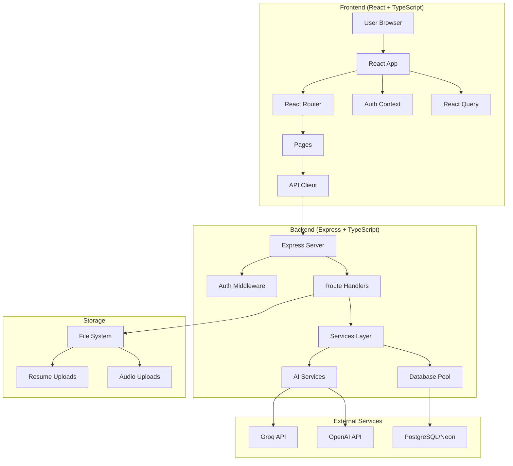

---

## 2. Authentication Workflow

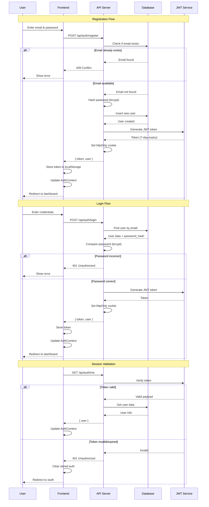

---

## 3. Resume Analysis Workflow

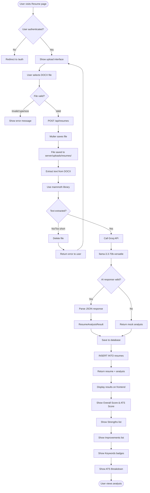

---

## 4. AI Interview Workflow - Complete Flow

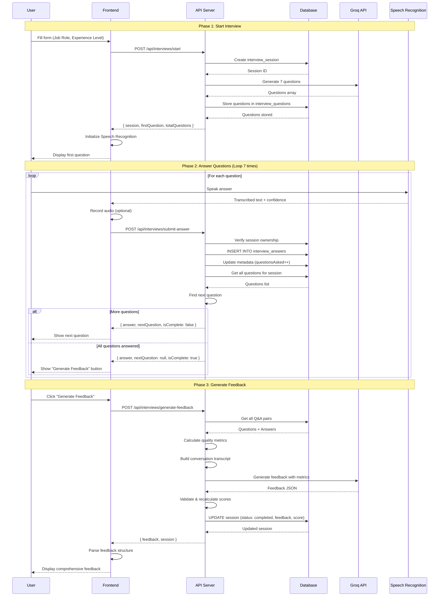

---

## 5. Interview Answer Submission - Detailed Flow

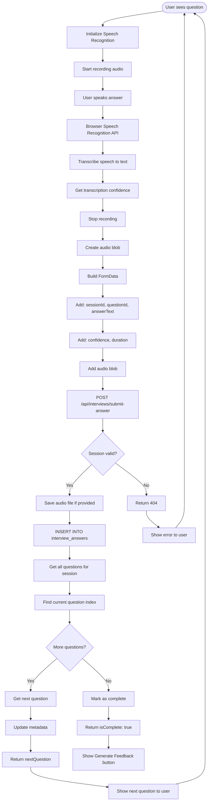

---

## 6. Feedback Generation - Detailed Flow

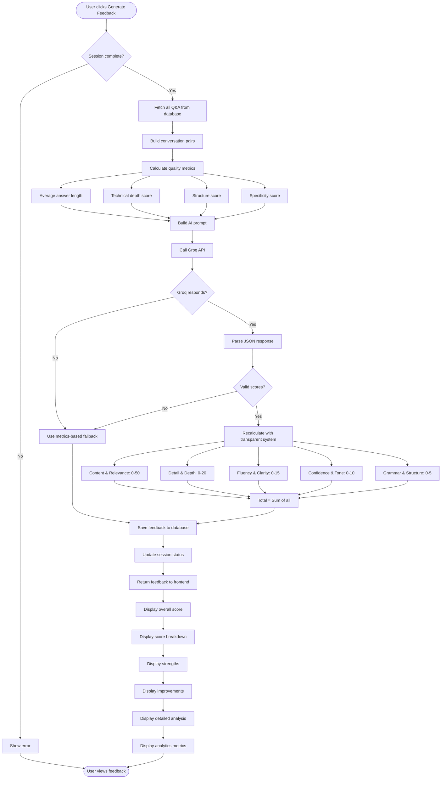

---

## 7. Database Operations Flow

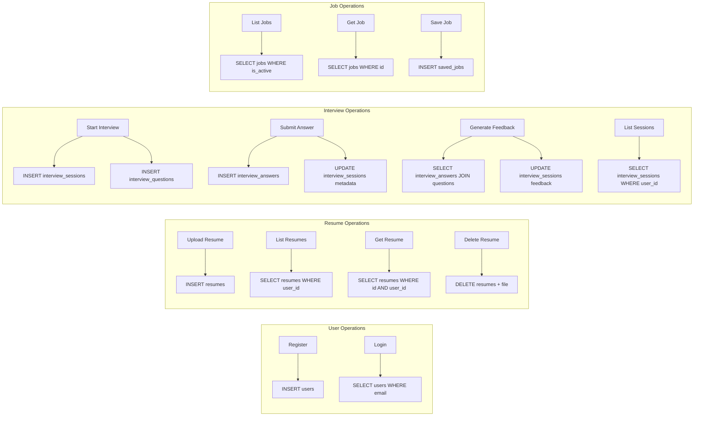

---

## 8. API Request Flow

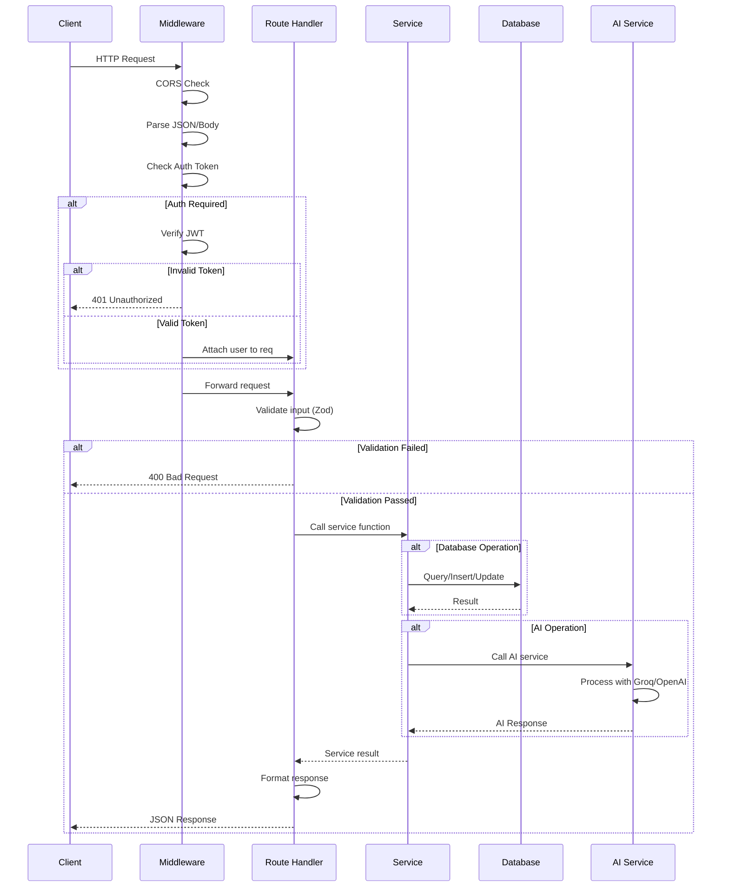

---

## 9. Error Handling Flow

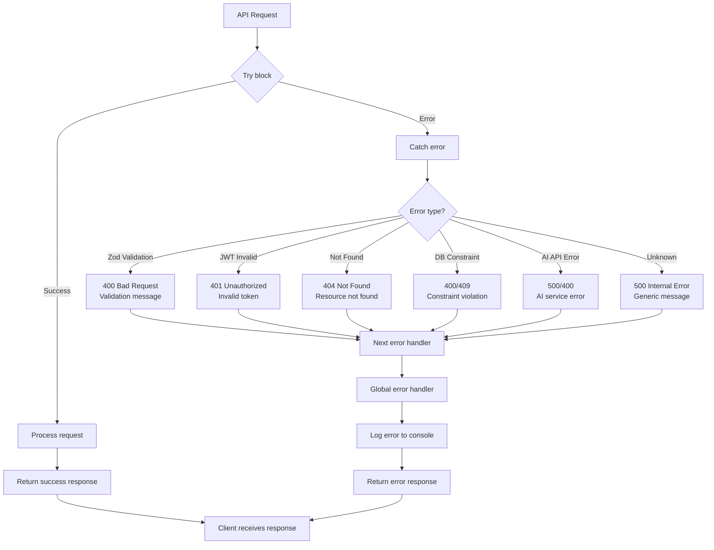

---

## 10. File Upload Flow

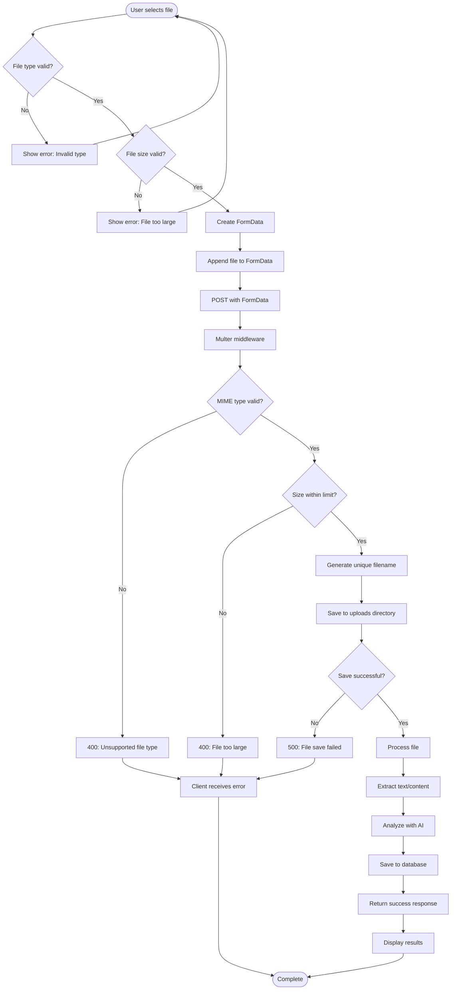

---

## 11. State Management Flow (Frontend)

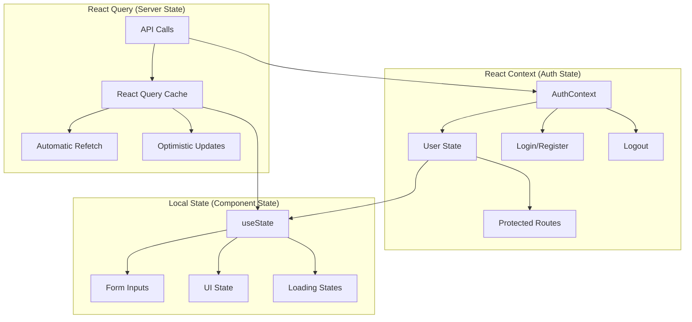

---

## 12. Complete User Journey

---

## 13. Security Flow

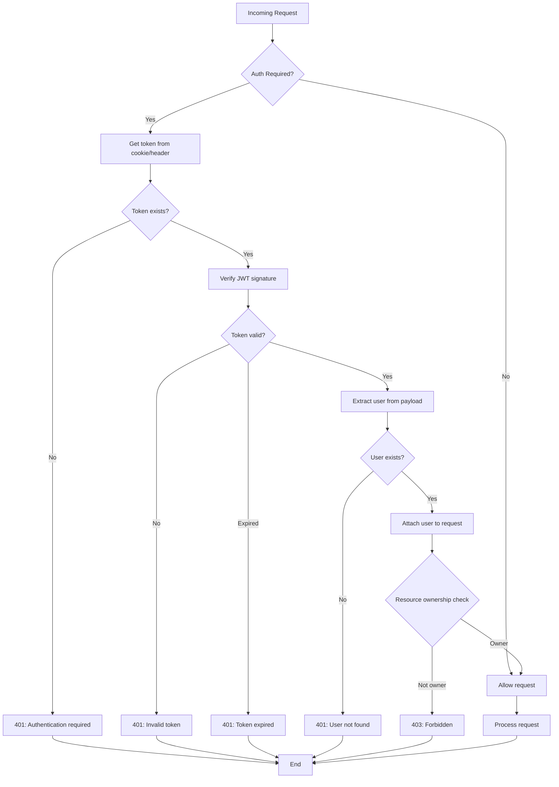

---

## Notes

- All diagrams use Mermaid syntax and can be rendered in:
  - GitHub/GitLab markdown
  - VS Code (with Mermaid extension)
  - Online Mermaid editors
  - Documentation tools (Docusaurus, MkDocs, etc.)

- To view these diagrams:
  1. Copy the Mermaid code blocks
  2. Paste into https://mermaid.live/
  3. Or use a VS Code extension like "Markdown Preview Mermaid Support"

- These workflows represent the complete system architecture and data flow for Career Echo AI.

